# GPIO

### Setting the GPIO Driver as LL (Lower Level)

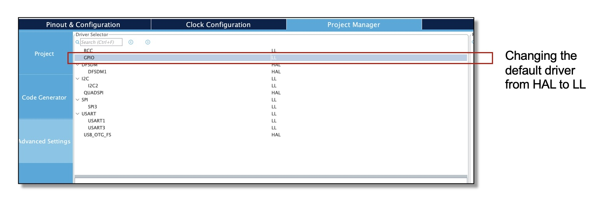
### Button Configuration
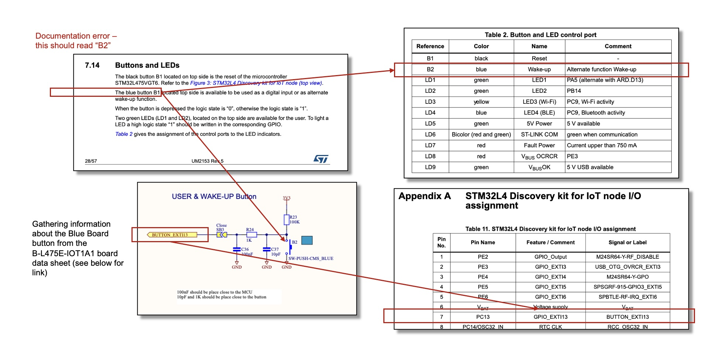
Board data sheet: https://www.st.com/resource/en/user_manual/um2153-discovery-kit-for-iot-node-multichannel-communication-with-stm32l4-stmicroelectronics.pdf
### Button Logic

### Button Coding Configuration
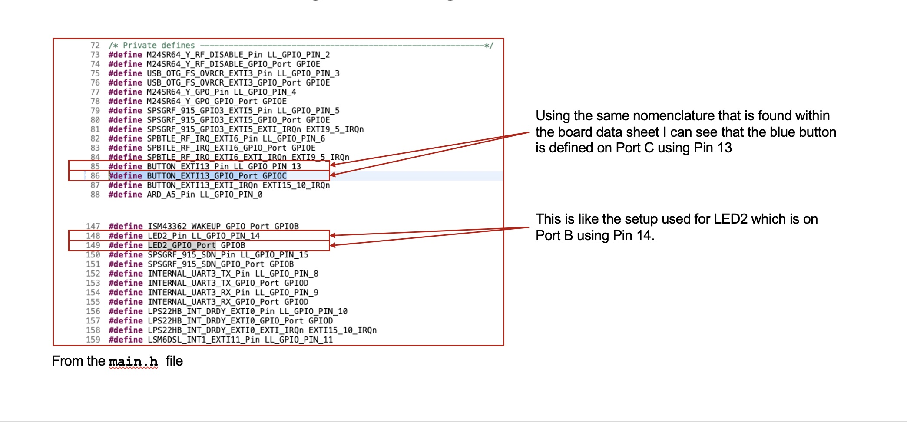
### Flash Size Function
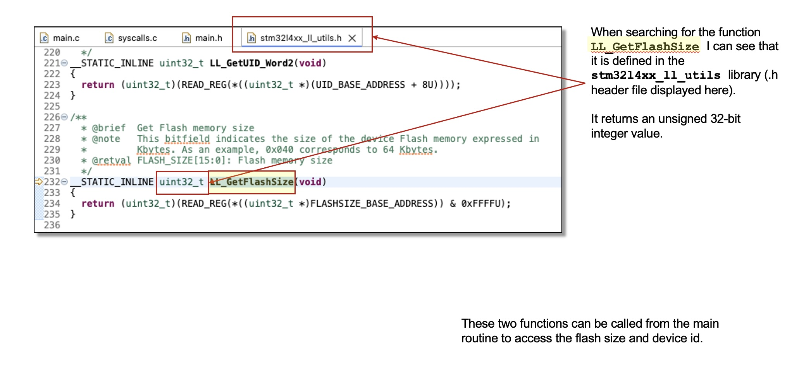
### Unique Device Function
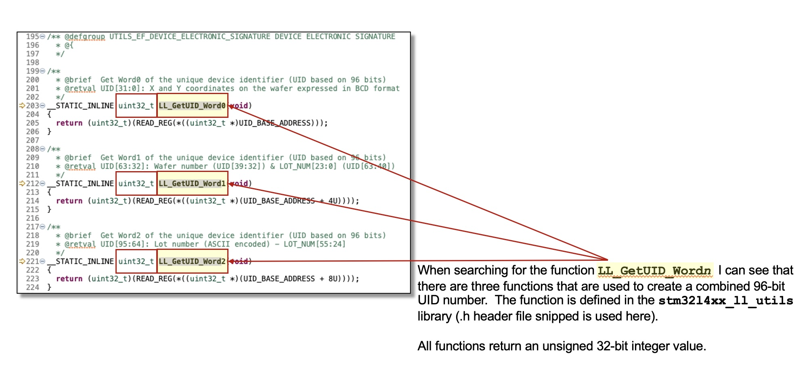
### Peripheral Code Initialization
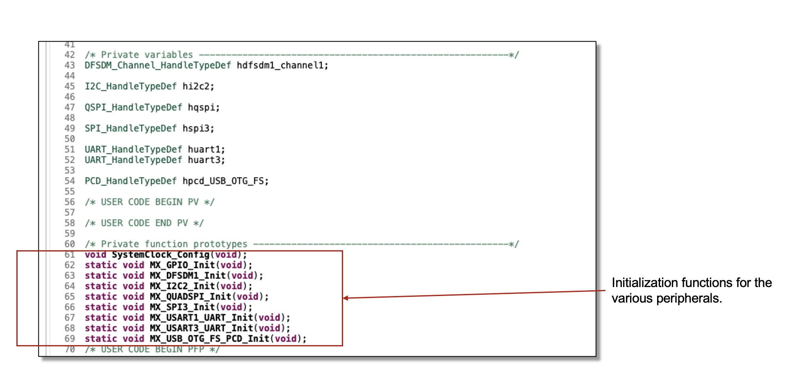
### Low Level APIs (LL Prefix)
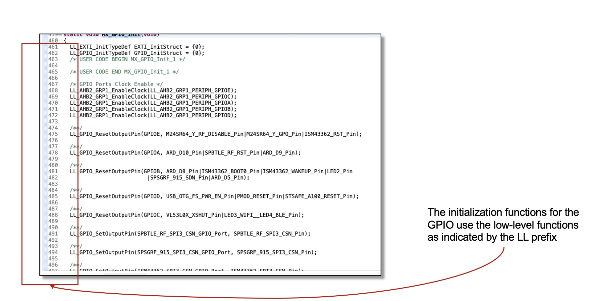
### Pre-Defined Toggle Function
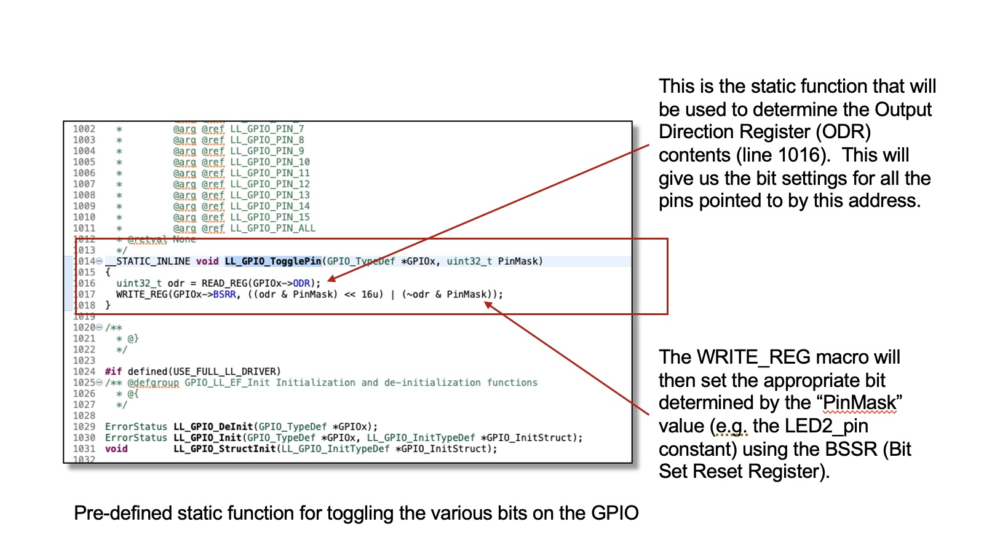
### Intermediate Test
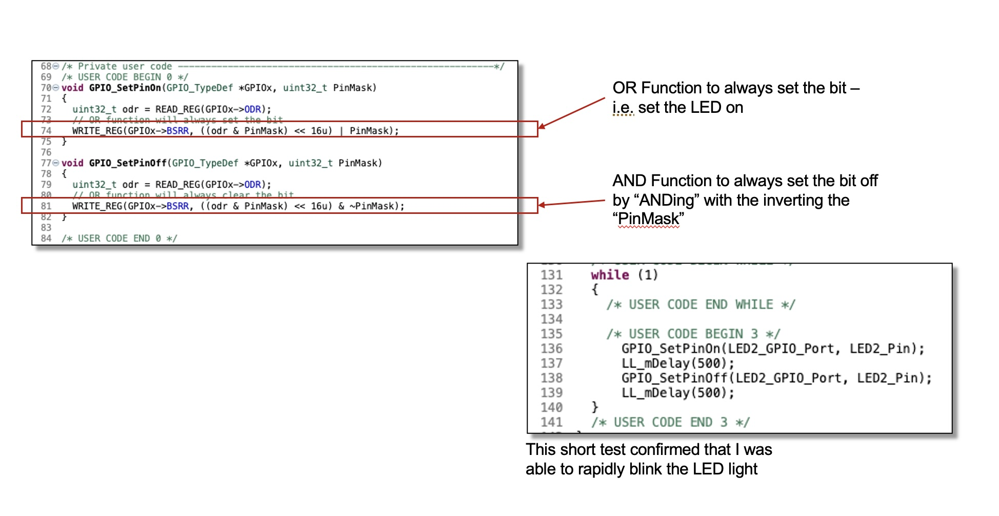
### Final Working Solution Code
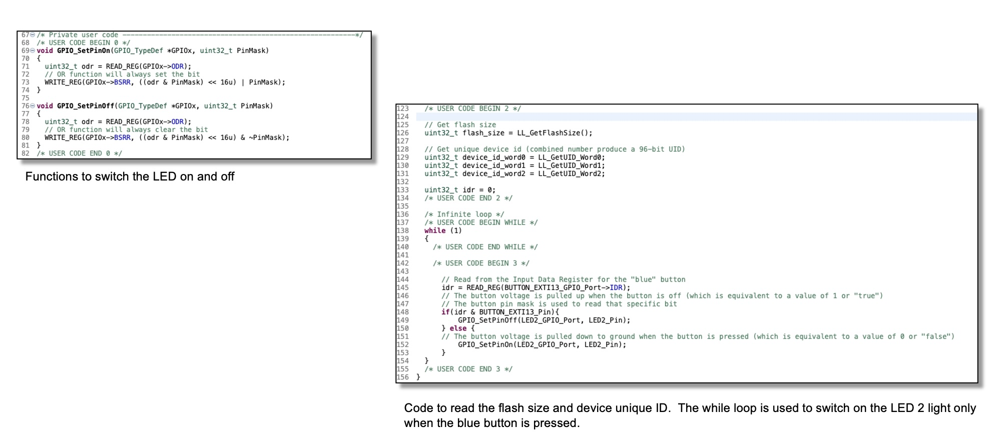
### Working System
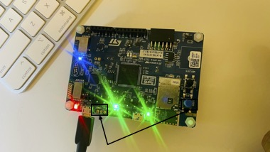
LED Light not activated; blue button not pressed.

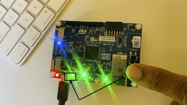
Blue button pressed and LED Light switched on

