# HAL (Hardware Abstraction Layer)

### Settings - Pin Layout

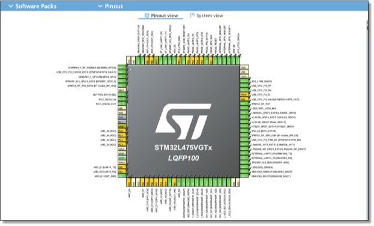

### Drivers set to HAL
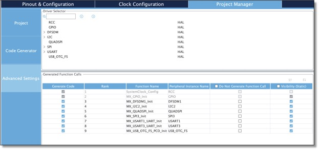

### File and Organization
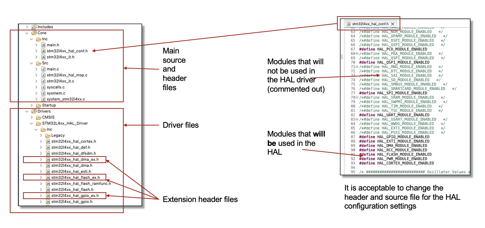

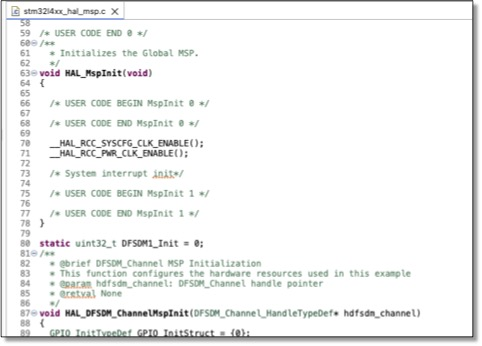

### HAL Functions
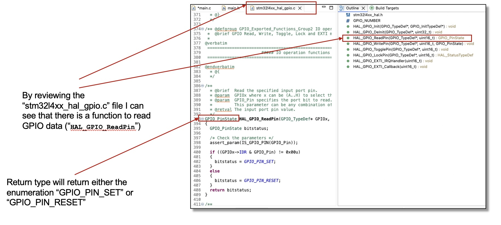

### Solution Code
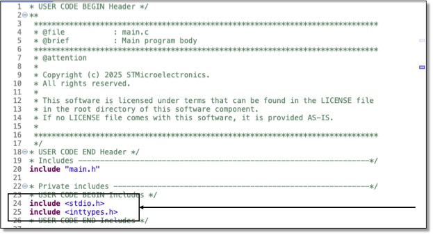

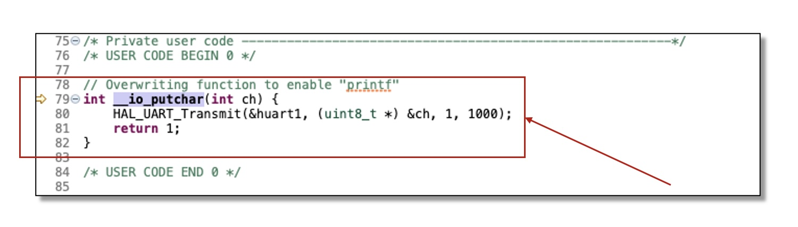

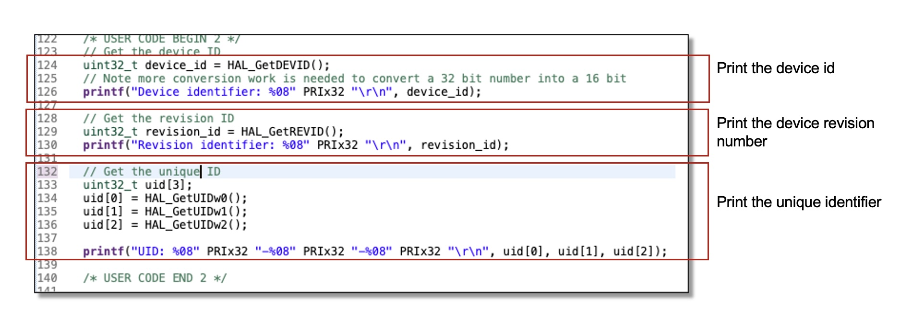

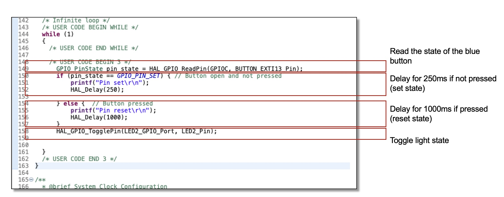

### Board
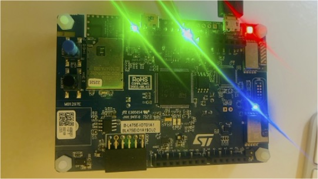
The light flashes every 250 when the blue button is not pressed;
If the button is pressed then the light will flash every 1000ms

### Testing and Validation (Screen Output)
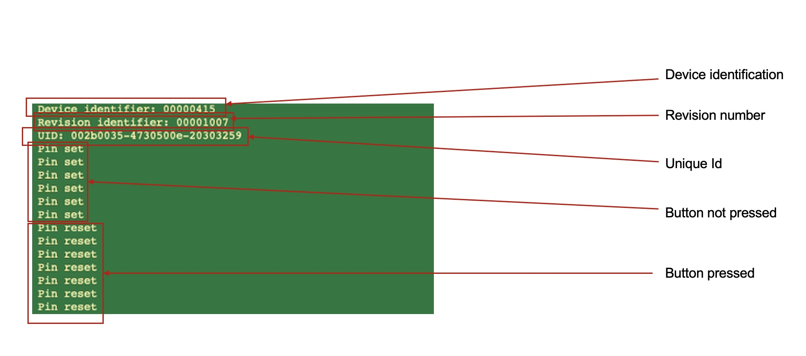
The following screen command was used: `screen /dev/tty.usbmodem21403 115200`

### Button Configuration

### Button Logic
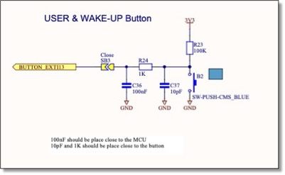

